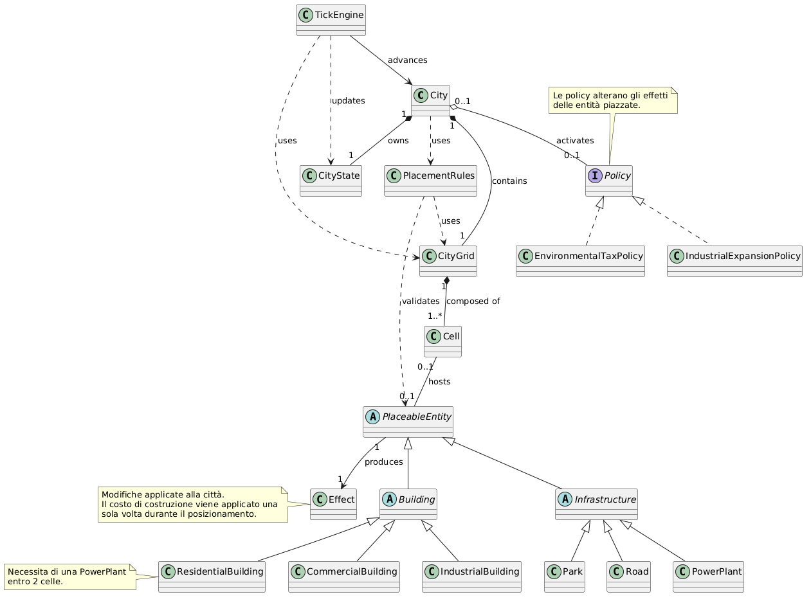
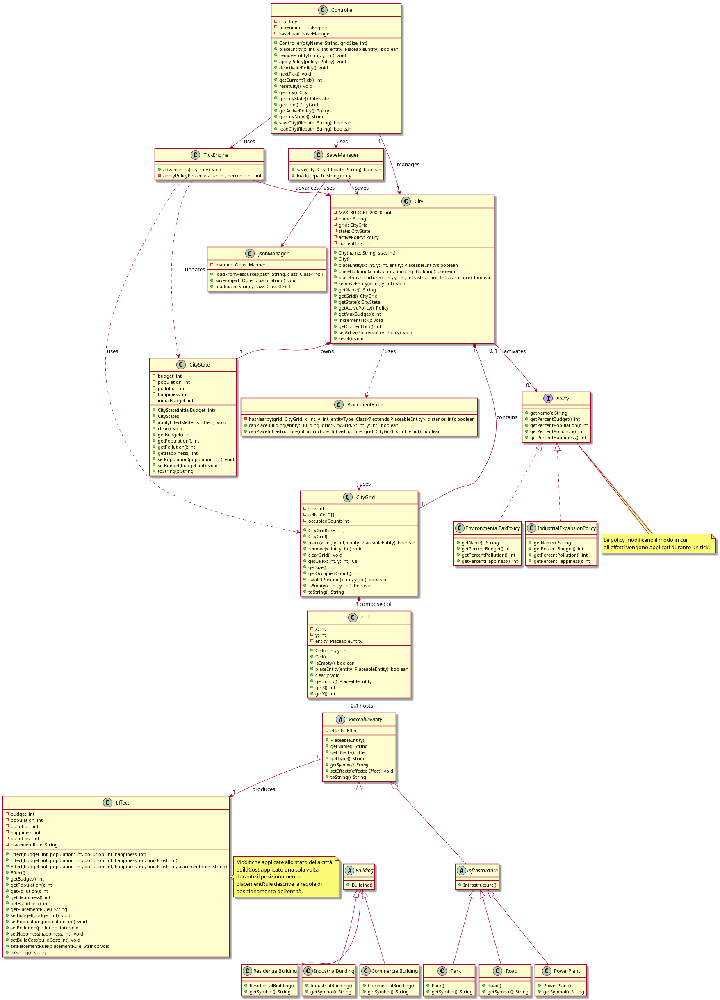
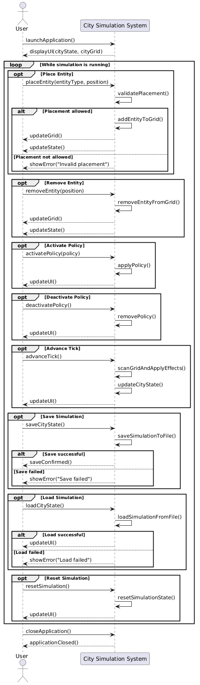
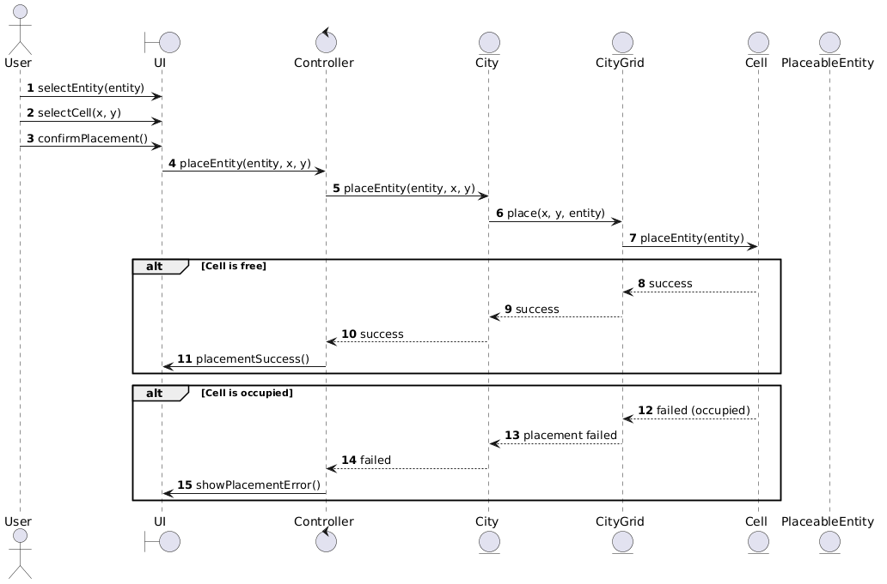
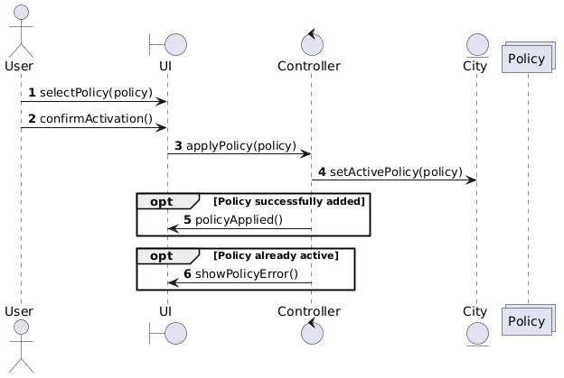
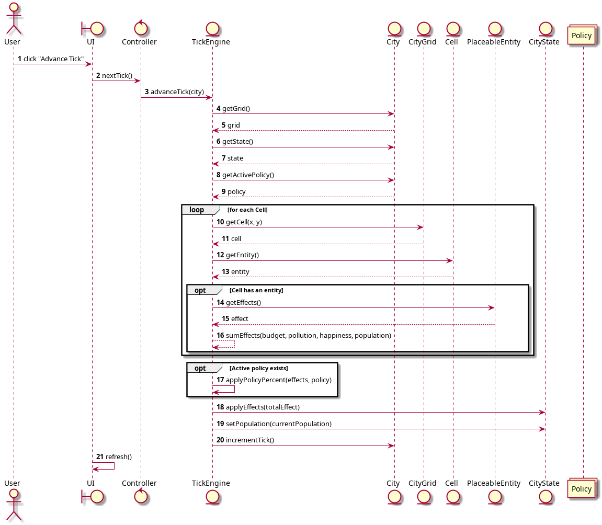
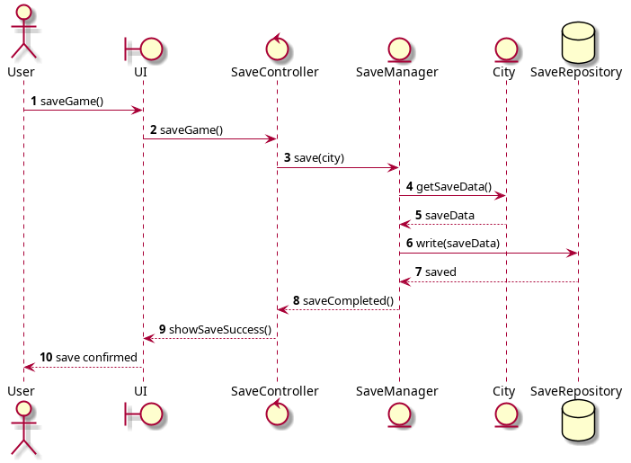
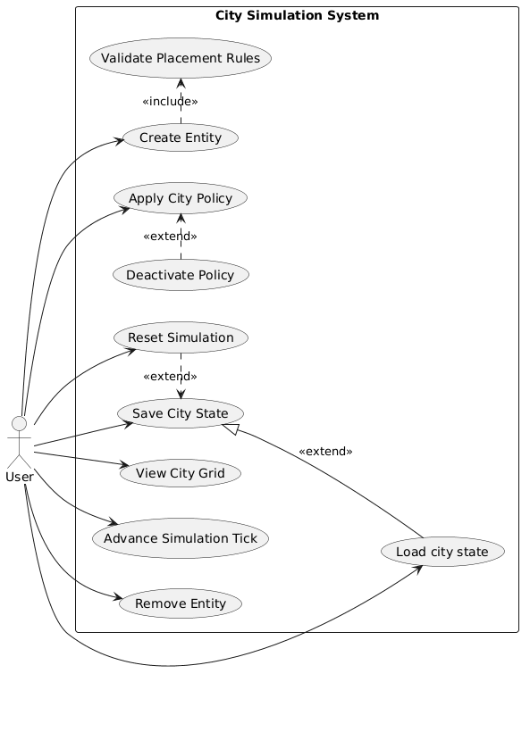

# Domain Class Model
```
Il Domain Model rappresenta le entità principali del sistema City Simulator e le loro relazioni.
Il modello è focalizzato esclusivamente sulle classi del dominio:
- Il modello quindi non include classi di controllo (Controller), persistenza (SaveManager, JsonManager)
o interfaccia utente (UserInterface), in quanto non fanno parte del dominio.
- PlacementRules e TickEngine sono incluse in quanto rappresentano logica di dominio
(regole di posizionamento e simulazione temporale).
```
## Codice
[Vai al codice del Domain Class Model](diagrams_md/design_class_model.md)



# Design Class Model
```
Il Design Class Model rappresenta l'architettura completa del sistema City Simulator,
includendo non solo le classi del dominio ma anche i componenti di controllo, persistenza,
supporto all'interfaccia utente e factory. Il modello fornisce una visione dettagliata
delle relazioni tra tutti i componenti del sistema.
```


# Sequence diagrams

## External sequence diagram
```
Questo diagramma mostra le principali interazioni tra l'utente e il sistema.
L'utente può gestire la simulazione attraverso operazioni quali posizionamento e rimozione di entità,
attivazione di policy, avanzamento dei tick, salvataggio, caricamento e reset della città.
```


# Internal Sequence Diagrams

## Create entity

```
Questo diagramma descrive il flusso di creazione di una nuova entità nella griglia.
Il controller delega l'operazione alla città, che verifica la disponibilità della
cella e aggiorna lo stato del sistema in caso di successo oppure notifica un errore
in caso di posizionamento non valido.
```


## Activate Policy
```
Questo diagramma rappresenta il processo di attivazione di una policy cittadina.
Dopo la selezione da parte dell'utente, la policy viene impostata come attiva
nella città e l'interfaccia viene aggiornata per riflettere il nuovo comportamento della simulazione.
```


## Tick
```
Questo diagramma descrive il funzionamento del motore di simulazione.
Ad ogni tick vengono analizzate le entità presenti nella griglia, calcolati
gli effetti complessivi e applicate eventuali modifiche derivanti dalla policy
 attiva prima dell'aggiornamento dello stato della città.
```


## Save City State
```
Questo diagramma mostra il processo di salvataggio della simulazione.
Lo stato della città viene serializzato in formato JSON e scritto su file;
l'utente riceve una conferma in caso di successo oppure un messaggio di errore
in caso di problemi durante il salvataggio.
```


## Use Case Diagram
```
Il Use Case Diagram rappresenta le funzionalità principali del sistema City Simulator
dal punto di vista dell'utente. Il diagramma mostra le interazioni tra l'attore User
e il sistema, identificando i casi d'uso principali e le loro relazioni.
```


