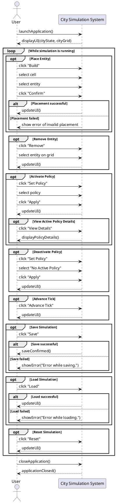
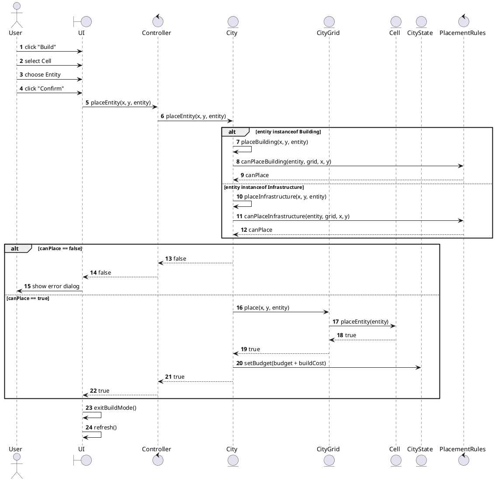
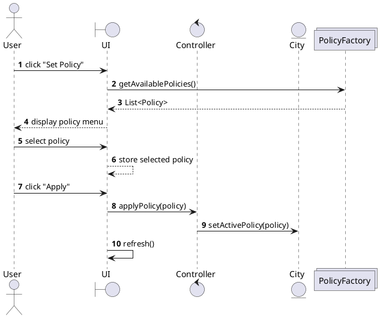
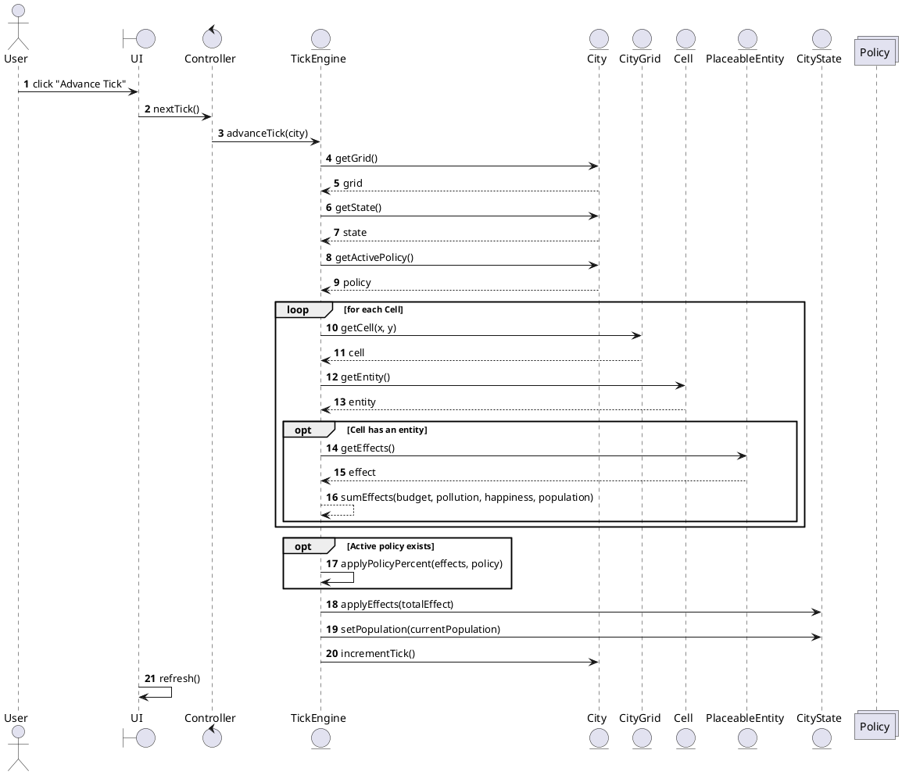
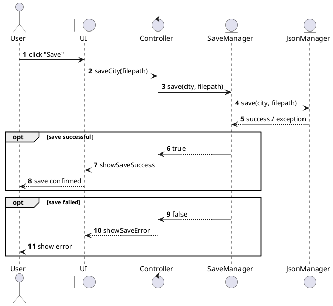

# Sequence diagrams

## External sequence diagram

```plantuml
@startuml
actor User
participant "City Simulation System" as System

User -> System : launchApplication()
System --> User : displayUI(cityState, cityGrid)

loop While simulation is running


opt Place Entity
    User -> System : click "Build"
    User -> System : select cell
    User -> System : select entity
    User -> System : click "Confirm"

    alt Placement successful
        System --> User : updateUI()
    else Placement failed
        System --> User : show error of invalid placement
    end
end

opt Remove Entity
    User -> System : click "Remove"
    User -> System : select entity on grid
    System --> User : updateUI()
end

opt Activate Policy
    User -> System : click "Set Policy"
    User -> System : select policy
    User -> System : click "Apply"
    System --> User : updateUI()

    opt View Active Policy Details
        User -> System : click "View Details"
        System --> User : displayPolicyDetails()
    end
end

opt Deactivate Policy
    User -> System : click "Set Policy"
    User -> System : select "No Active Policy"
    User -> System : click "Apply"
    System --> User : updateUI()
end

opt Advance Tick
    User -> System : click "Advance Tick"
    System --> User : updateUI()
end

opt Save Simulation
    User -> System : click "Save"

    alt Save successful
        System --> User : saveConfirmed()
    else Save failed
        System --> User : showError("Error while saving.")
    end
end

opt Load Simulation
    User -> System : click "Load"

    alt Load successful
        System --> User : updateUI()
    else Load failed
        System --> User : showError("Error while loading.")
    end
end

opt Reset Simulation
    User -> System : click "Reset"
    System --> User : updateUI()
end


end

User -> System : closeApplication()
System --> User : applicationClosed()

@enduml
```
# Internal Sequence Diagrams

## Create entity

```plantuml

@startuml
autonumber

actor User
boundary UI
control Controller
entity City
entity CityGrid
entity Cell
entity CityState
control PlacementRules

User -> UI : click "Build"
User -> UI : select Cell
User -> UI : choose Entity
User -> UI : click "Confirm"

UI -> Controller : placeEntity(x, y, entity)

Controller -> City : placeEntity(x, y, entity)

alt entity instanceof Building
    City -> City : placeBuilding(x, y, entity)
    City -> PlacementRules : canPlaceBuilding(entity, grid, x, y)
    PlacementRules --> City : canPlace
else entity instanceof Infrastructure
    City -> City : placeInfrastructure(x, y, entity)
    City -> PlacementRules : canPlaceInfrastructure(entity, grid, x, y)
    PlacementRules --> City : canPlace
end

alt canPlace == false
    City --> Controller : false
    Controller --> UI : false
    UI -> User : show error dialog
else canPlace == true
    City -> CityGrid : place(x, y, entity)
    CityGrid -> Cell : placeEntity(entity)

    Cell --> CityGrid : true
    CityGrid --> City : true
        
    City -> CityState : setBudget(budget + buildCost)
        
    City --> Controller : true
    Controller --> UI : true
  end      
    UI -> UI : exitBuildMode()
    UI -> UI : refresh()
 
@enduml

```

## Activate Policy

```plantuml
@startuml
autonumber

actor User

boundary UI
control Controller
entity City
collections PolicyFactory

User -> UI : click "Set Policy"

UI -> PolicyFactory : getAvailablePolicies()
PolicyFactory --> UI : List<Policy>

UI --> User : display policy menu

User -> UI : select policy
UI --> UI : store selected policy

User -> UI : click "Apply"

UI -> Controller : applyPolicy(policy)
Controller -> City : setActivePolicy(policy)

UI -> UI : refresh()

@enduml
```
## Tick

```plantuml
@startuml
autonumber

actor User

boundary UI
control Controller
entity TickEngine
entity City
entity CityGrid
entity Cell
entity PlaceableEntity
entity CityState
collections Policy

User -> UI : click "Advance Tick"
UI -> Controller : nextTick()

Controller -> TickEngine : advanceTick(city)

TickEngine -> City : getGrid()
City --> TickEngine : grid

TickEngine -> City : getState()
City --> TickEngine : state

TickEngine -> City : getActivePolicy()
City --> TickEngine : policy

loop for each Cell

    TickEngine -> CityGrid : getCell(x, y)
    CityGrid --> TickEngine : cell

    TickEngine -> Cell : getEntity()
    Cell --> TickEngine : entity

    opt Cell has an entity

        TickEngine -> PlaceableEntity : getEffects()
        PlaceableEntity --> TickEngine : effect

        TickEngine --> TickEngine : sumEffects(budget, pollution, happiness, population)

    end

end

opt Active policy exists

    TickEngine -> TickEngine : applyPolicyPercent(effects, policy)

end

TickEngine -> CityState : applyEffects(totalEffect)
TickEngine -> CityState : setPopulation(currentPopulation)


TickEngine -> City : incrementTick()


UI -> UI : refresh()

@enduml

```
## Save City State

```plantuml
@startuml
autonumber

actor User

boundary UI
control Controller
entity SaveManager
entity JsonManager

User -> UI : click "Save"

UI -> Controller : saveCity(filepath)

Controller -> SaveManager : save(city, filepath)

SaveManager -> JsonManager : save(city, filepath)

JsonManager --> SaveManager : success / exception

opt save successful
SaveManager --> Controller : true
Controller --> UI : showSaveSuccess
UI --> User : save confirmed
end

opt save failed
SaveManager --> Controller : false
Controller --> UI : showSaveError
UI --> User : show error
end

@enduml
```

